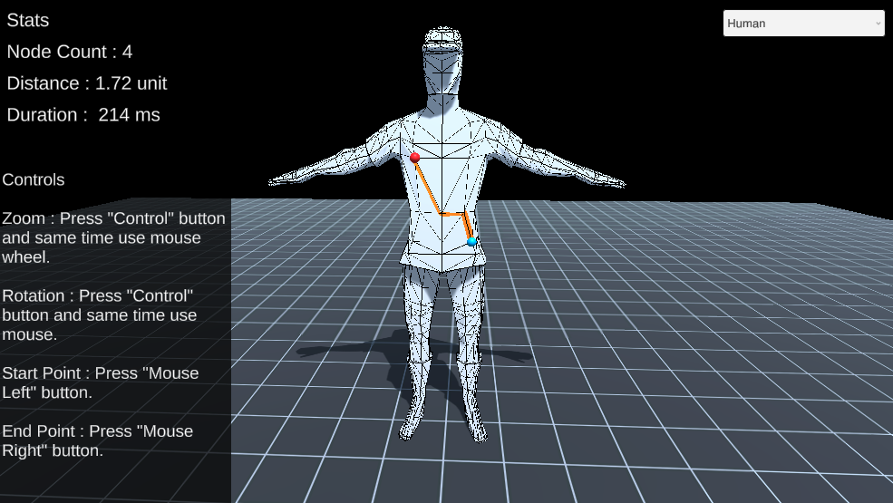
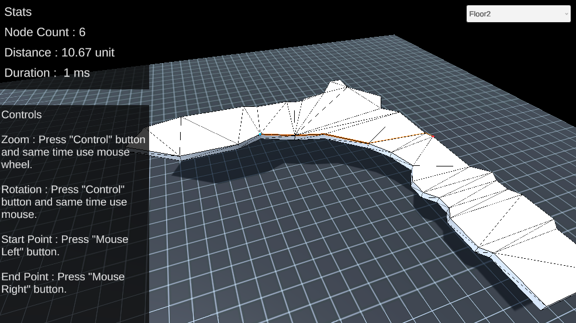

# Shortest Path
* Finding the shortest path between two points.
* This project developed on Unity 2020.3.26f1.

# How to se
* Open "Main" scene in the "Scenes" folder.
* Import TexMesh Pro essentials files.

# Screeshots

Humanoid:

Floor:

